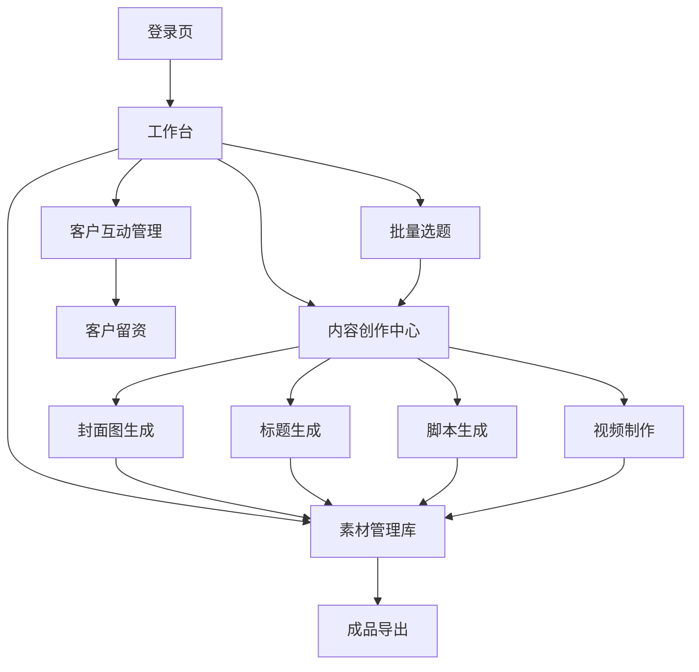

## 1. 产品概述
良木家具AI自媒体内容生成平台，专为家居行业营销团队打造的智能化内容生产工具。通过AI技术批量生成选题、封面、标题、脚本和视频，大幅提升内容制作效率，降低人力成本。

## 2. 核心功能

### 2.1 用户角色
| 角色 | 注册方式 | 核心权限 |
|------|----------|----------|
| 内容运营 | 企业邮箱注册 | 使用全部AI生成功能，管理内容库 |
| 营销经理 | 企业邮箱注册 | 审核内容，查看数据分析，管理客户回复 |
| 设计师 | 企业邮箱注册 | 上传参考素材，调整视觉风格 |

### 2.2 功能模块
平台包含以下核心页面：
1. **工作台**：批量选题生成、行业模板展示、任务进度概览
2. **内容创作中心**：封面图生成、标题生成、脚本生成、视频自动制作
3. **素材管理库**：参考图片上传、现有素材管理、成品内容预览
4. **客户互动管理**：自动回复配置、留资引导设置、客户信息管理

### 2.3 页面详情
| 页面名称 | 模块名称 | 功能描述 |
|----------|----------|----------|
| 工作台 | 批量选题生成 | 输入关键词，AI生成10-20个家居相关选题，支持按风格筛选 |
| 工作台 | 行业模板库 | 展示现代简约、新中式、北欧等家居风格模板和成功案例 |
| 工作台 | 任务看板 | 显示进行中的内容任务进度，支持批量操作 |
| 内容创作中心 | 封面图生成 | 上传参考图，AI批量生成5-10张封面图，支持风格调整 |
| 内容创作中心 | 标题生成 | 基于选题和封面图，生成吸引人的标题，支持A/B测试版本 |
| 内容创作中心 | 脚本生成 | 根据选题生成视频脚本，包含开场、产品介绍、结尾引导 |
| 内容创作中心 | 视频制作 | 选择素材和脚本，AI自动剪辑生成15-60秒短视频 |
| 素材管理库 | 参考图上传 | 支持批量上传家居场景图，自动分类和标签化 |
| 素材管理库 | 成品预览 | 查看生成的封面、视频，支持下载和一键发布 |
| 客户互动管理 | 自动回复配置 | 设置关键词触发自动回复，引导客户留下联系方式 |
| 客户互动管理 | 留资引导 | 配置私信话术，自动发送产品介绍和预约链接 |
| 客户互动管理 | 客户信息 | 查看留资客户列表，导出联系方式给销售团队 |

## 3. 核心流程
用户登录后进入工作台，选择需要的功能模块。内容创作流程：先生成选题→制作封面→生成标题→编写脚本→合成视频。所有生成的内容都会保存到素材库，支持重复使用和二次编辑。

## 4. 用户界面设计

### 4.1 设计风格
- 主色调：温润木色(#8B4513)搭配米白色(#FAF8F5)
- 辅助色：深胡桃色(#654321)和暖灰色(#D4C4B0)
- 按钮样式：圆角矩形，悬停效果，体现家居的温暖感
- 字体：思源黑体为主，标题使用较大字号(24-32px)
- 布局：卡片式设计，留白充足，营造高端家居品牌感
- 图标：使用线性图标，简洁现代

### 4.2 页面设计概览
| 页面名称 | 模块名称 | UI元素 |
|----------|----------|--------|
| 工作台 | 顶部导航 | 良木家具Logo，用户头像，消息通知图标 |
| 工作台 | 功能卡片 | 4个大卡片展示核心功能，配有家居场景背景图 |
| 内容创作中心 | 左侧工具栏 | 竖向排列的生成工具图标，当前选中高亮显示 |
| 内容创作中心 | 右侧预览区 | 实时显示生成效果，支持全屏预览和下载 |
| 素材管理库 | 网格布局 | 瀑布流展示素材缩略图，支持拖拽排序 |
| 客户互动管理 | 列表视图 | 表格形式展示客户信息，支持筛选和导出 |

### 4.3 响应式设计
采用桌面端优先设计，适配1920×1080主流分辨率。移动端保持核心功能可用，简化操作流程。触摸交互优化，按钮大小适合手指点击。