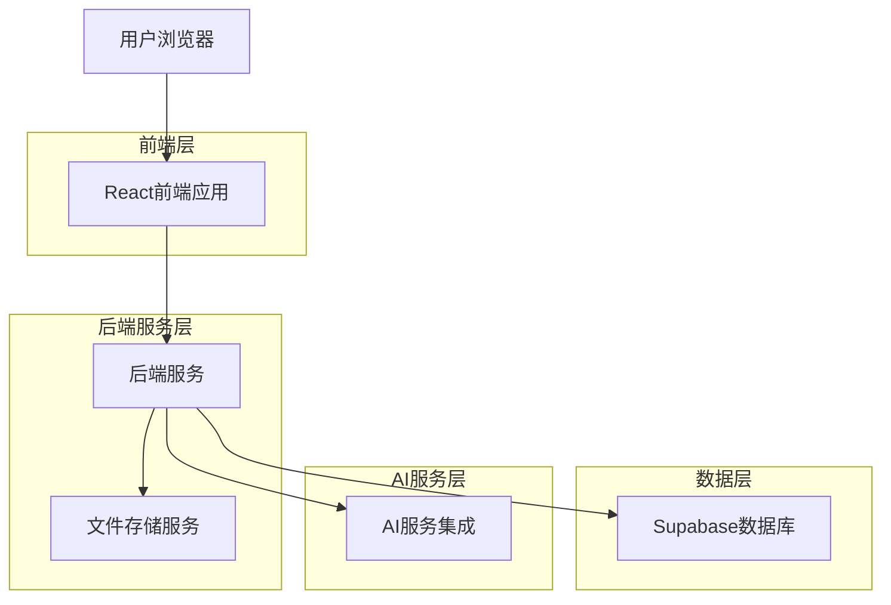
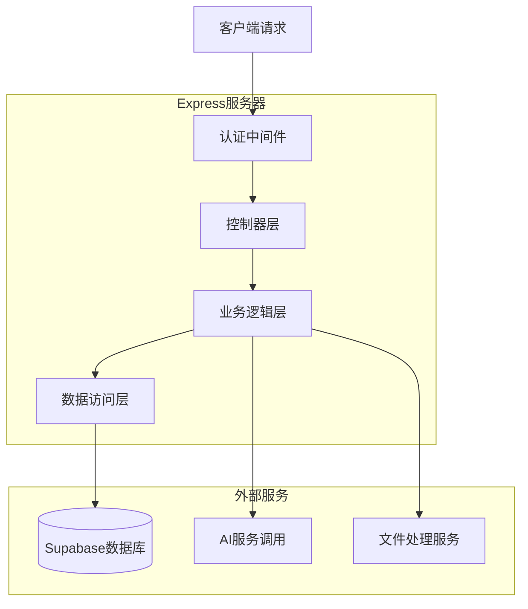
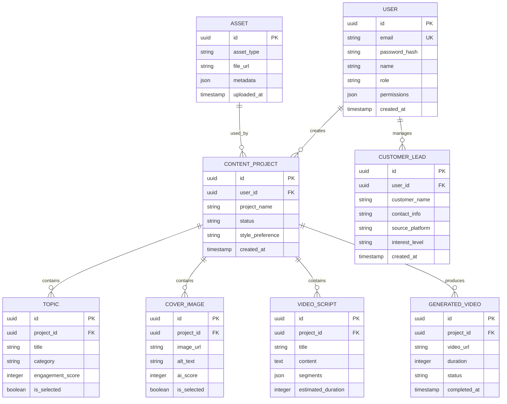

## 1. 架构设计



## 2. 技术描述
- 前端：React@18 + TypeScript + TailwindCSS + Vite
- 初始化工具：vite-init
- 后端：Node.js@18 + Express@4
- 数据库：Supabase (PostgreSQL)
- 文件存储：Supabase Storage
- AI服务：OpenAI GPT-4、DALL-E、Stable Diffusion API
- 视频处理：FFmpeg + Remotion

## 3. 路由定义
| 路由 | 用途 |
|------|------|
| / | 登录页面 |
| /dashboard | 工作台首页 |
| /content/topic-generator | 批量选题生成 |
| /content/cover-generator | 封面图生成 |
| /content/title-generator | 标题生成 |
| /content/script-generator | 脚本生成 |
| /content/video-generator | 视频制作 |
| /assets/library | 素材管理库 |
| /customer/auto-reply | 自动回复配置 |
| /customer/leads | 客户留资管理 |
| /settings | 系统设置 |

## 4. API定义

### 4.1 用户认证
```
POST /api/auth/login
```

请求参数：
| 参数名 | 参数类型 | 是否必需 | 描述 |
|--------|----------|----------|------|
| email | string | true | 企业邮箱地址 |
| password | string | true | 登录密码 |

响应：
```json
{
  "token": "jwt_token_string",
  "user": {
    "id": "user_id",
    "email": "user@liangmu.com",
    "role": "content_operator",
    "permissions": ["topic_generate", "content_create", "customer_manage"]
  }
}
```

### 4.2 批量选题生成
```
POST /api/content/generate-topics
```

请求参数：
| 参数名 | 参数类型 | 是否必需 | 描述 |
|--------|----------|----------|------|
| keywords | array | true | 关键词列表 |
| style | string | false | 家居风格（现代/中式/北欧等） |
| count | number | false | 生成数量，默认10个 |

响应：
```json
{
  "topics": [
    {
      "id": "topic_1",
      "title": "小户型客厅收纳技巧",
      "category": "空间利用",
      "engagement_score": 85
    }
  ]
}
```

### 4.3 封面图生成
```
POST /api/content/generate-covers
```

请求参数：
| 参数名 | 参数类型 | 是否必需 | 描述 |
|--------|----------|----------|------|
| reference_image | file | true | 参考图片文件 |
| topic_id | string | true | 选题ID |
| style | string | false | 视觉风格 |
| count | number | false | 生成数量，默认5张 |

响应：
```json
{
  "covers": [
    {
      "id": "cover_1",
      "url": "https://storage.supabase.co/cover_1.jpg",
      "alt_text": "现代简约客厅封面",
      "score": 92
    }
  ]
}
```

### 4.4 视频自动生成
```
POST /api/content/generate-video
```

请求参数：
| 参数名 | 参数类型 | 是否必需 | 描述 |
|--------|----------|----------|------|
| script_id | string | true | 脚本ID |
| asset_ids | array | true | 素材ID列表 |
| duration | number | false | 视频时长，默认30秒 |
| style | string | false | 剪辑风格 |

响应：
```json
{
  "video_id": "video_1",
  "status": "processing",
  "progress": 0,
  "estimated_time": 120
}
```

## 5. 服务器架构图



## 6. 数据模型

### 6.1 实体关系图


### 6.2 数据定义语言

用户表（users）
```sql
-- 创建用户表
CREATE TABLE users (
  id UUID PRIMARY KEY DEFAULT gen_random_uuid(),
  email VARCHAR(255) UNIQUE NOT NULL,
  password_hash VARCHAR(255) NOT NULL,
  name VARCHAR(100) NOT NULL,
  role VARCHAR(50) DEFAULT 'content_operator' CHECK (role IN ('content_operator', 'marketing_manager', 'designer')),
  permissions JSONB DEFAULT '[]',
  created_at TIMESTAMP WITH TIME ZONE DEFAULT NOW(),
  updated_at TIMESTAMP WITH TIME ZONE DEFAULT NOW()
);

-- 创建索引
CREATE INDEX idx_users_email ON users(email);
CREATE INDEX idx_users_role ON users(role);
```

内容项目表（content_projects）
```sql
-- 创建内容项目表
CREATE TABLE content_projects (
  id UUID PRIMARY KEY DEFAULT gen_random_uuid(),
  user_id UUID REFERENCES users(id) ON DELETE CASCADE,
  project_name VARCHAR(255) NOT NULL,
  status VARCHAR(50) DEFAULT 'draft' CHECK (status IN ('draft', 'in_progress', 'completed', 'archived')),
  style_preference VARCHAR(50) DEFAULT 'modern',
  created_at TIMESTAMP WITH TIME ZONE DEFAULT NOW(),
  updated_at TIMESTAMP WITH TIME ZONE DEFAULT NOW()
);

-- 创建索引
CREATE INDEX idx_content_projects_user_id ON content_projects(user_id);
CREATE INDEX idx_content_projects_status ON content_projects(status);
```

选题表（topics）
```sql
-- 创建选题表
CREATE TABLE topics (
  id UUID PRIMARY KEY DEFAULT gen_random_uuid(),
  project_id UUID REFERENCES content_projects(id) ON DELETE CASCADE,
  title VARCHAR(500) NOT NULL,
  category VARCHAR(100),
  engagement_score INTEGER DEFAULT 0,
  is_selected BOOLEAN DEFAULT false,
  created_at TIMESTAMP WITH TIME ZONE DEFAULT NOW()
);

-- 创建索引
CREATE INDEX idx_topics_project_id ON topics(project_id);
CREATE INDEX idx_topics_engagement_score ON topics(engagement_score DESC);
```

封面图片表（cover_images）
```sql
-- 创建封面图片表
CREATE TABLE cover_images (
  id UUID PRIMARY KEY DEFAULT gen_random_uuid(),
  project_id UUID REFERENCES content_projects(id) ON DELETE CASCADE,
  image_url TEXT NOT NULL,
  alt_text VARCHAR(500),
  ai_score INTEGER DEFAULT 0,
  is_selected BOOLEAN DEFAULT false,
  created_at TIMESTAMP WITH TIME ZONE DEFAULT NOW()
);

-- 创建索引
CREATE INDEX idx_cover_images_project_id ON cover_images(project_id);
CREATE INDEX idx_cover_images_ai_score ON cover_images(ai_score DESC);
```

客户留资表（customer_leads）
```sql
-- 创建客户留资表
CREATE TABLE customer_leads (
  id UUID PRIMARY KEY DEFAULT gen_random_uuid(),
  user_id UUID REFERENCES users(id) ON DELETE CASCADE,
  customer_name VARCHAR(100),
  contact_info VARCHAR(255),
  source_platform VARCHAR(100),
  interest_level VARCHAR(50) DEFAULT 'warm' CHECK (interest_level IN ('cold', 'warm', 'hot')),
  notes TEXT,
  created_at TIMESTAMP WITH TIME ZONE DEFAULT NOW()
);

-- 创建索引
CREATE INDEX idx_customer_leads_user_id ON customer_leads(user_id);
CREATE INDEX idx_customer_leads_created_at ON customer_leads(created_at DESC);
```

-- 权限设置
GRANT SELECT ON users TO anon;
GRANT ALL PRIVILEGES ON users TO authenticated;
GRANT SELECT ON content_projects TO anon;
GRANT ALL PRIVILEGES ON content_projects TO authenticated;
GRANT SELECT ON topics TO anon;
GRANT ALL PRIVILEGES ON topics TO authenticated;
GRANT SELECT ON cover_images TO anon;
GRANT ALL PRIVILEGES ON cover_images TO authenticated;
GRANT SELECT ON customer_leads TO anon;
GRANT ALL PRIVILEGES ON customer_leads TO authenticated;